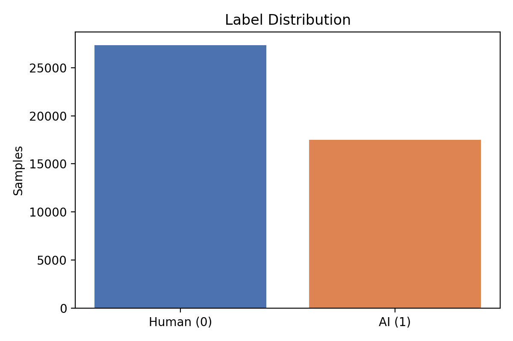
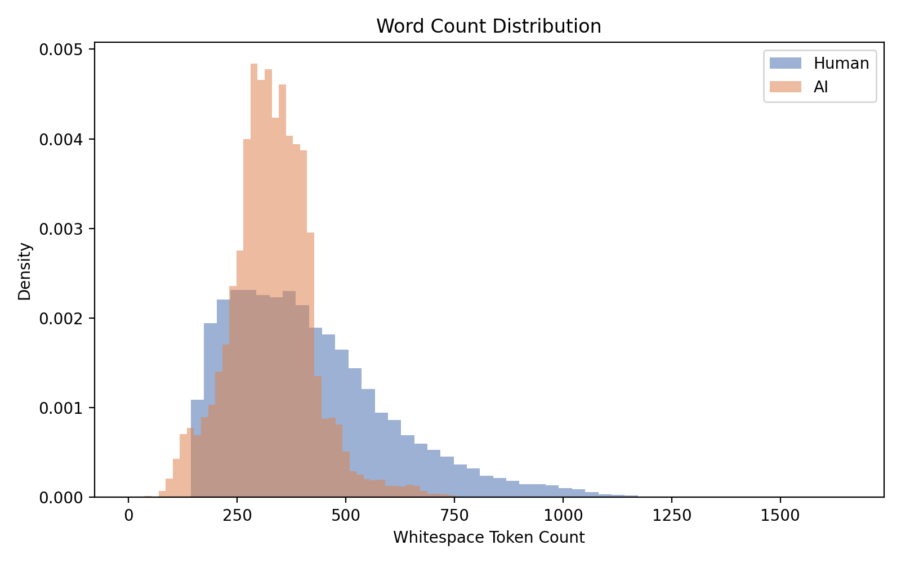
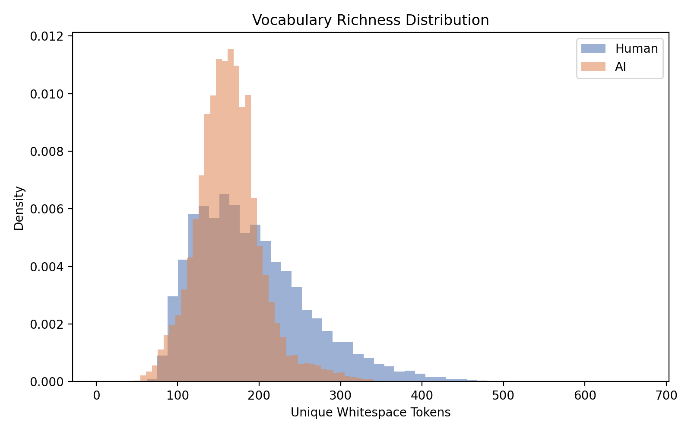
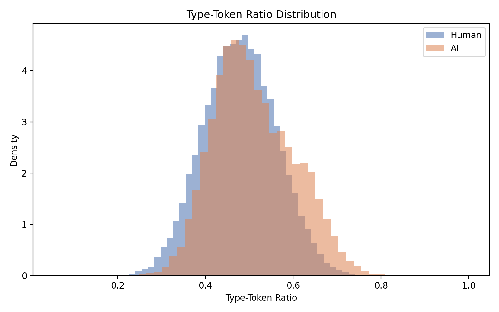
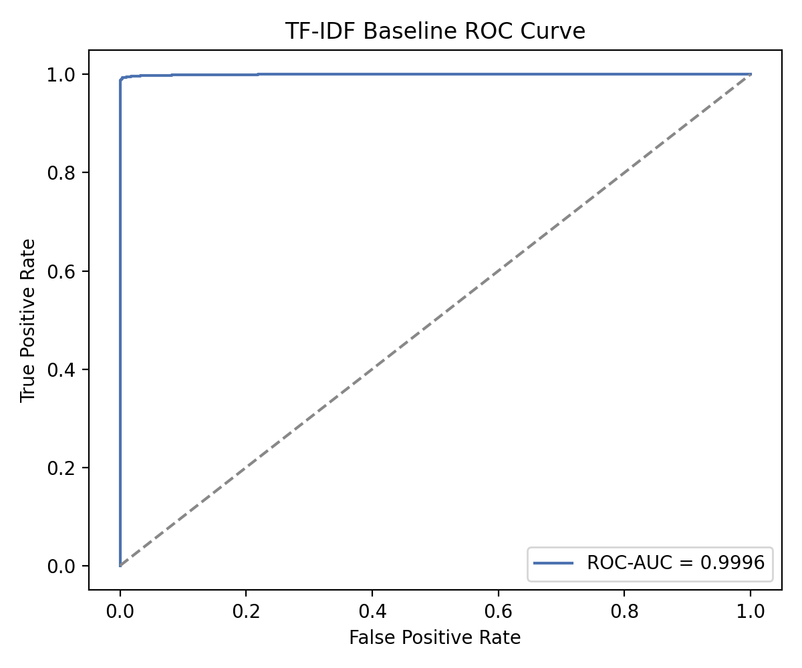
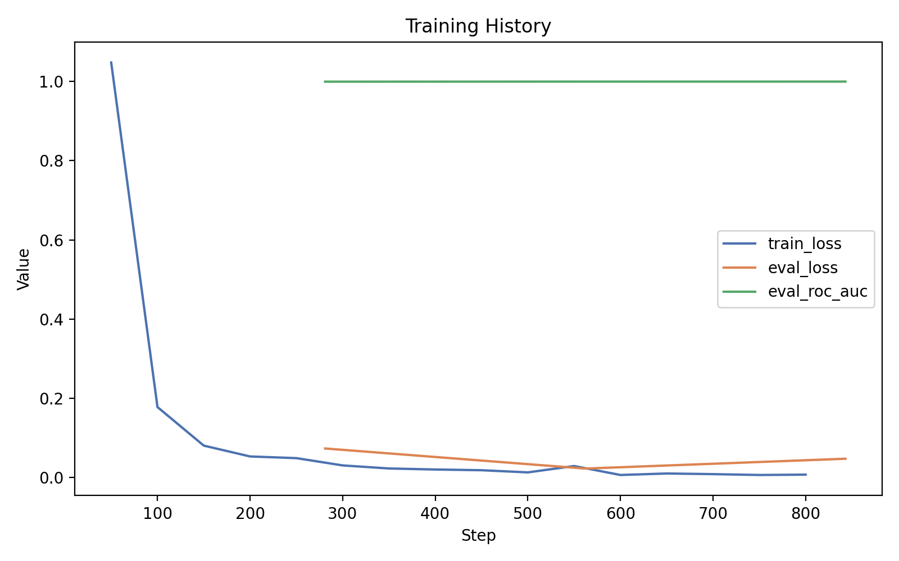
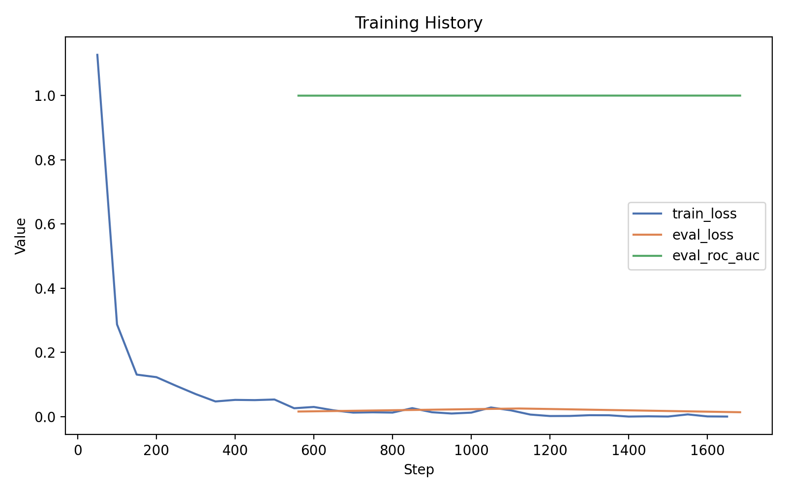

# Homework 2: Detecting AI-Generated Text with TF-IDF, BERT Scaling, and Local LLM Adversarial Attacks

## 1. Introduction
This homework studies AI-generated text detection on the `train_v2_drcat_02.csv` dataset using three stages: a classical TF-IDF baseline, fine-tuned BERT models of different scales, and a local LLM-based adversarial attack. The goal is not only to maximize ROC-AUC, but also to understand whether larger models are meaningfully better and whether a modern local generator can fool the best detector.

The final results show that the task is already highly separable with lexical features alone. A TF-IDF + Logistic Regression baseline reached a ROC-AUC of `0.999634`, and both BERT models improved on that number only slightly. `bert-large-cased` achieved the best overall ROC-AUC at `0.999887`, but the gain over `bert-base-cased` was very small relative to the added compute cost. For the adversarial setting, a local `Mistral-7B-Instruct-v0.3` rewrite attack usually made human essays look *more* AI-like to the detector, although one prompt/article combination did successfully fool the best model.

Overall, this assignment suggests three takeaways. First, the dataset contains strong lexical and stylistic signals that are easy for both classical and neural models to exploit. Second, model scaling helps, but with quickly diminishing returns on this task. Third, the detector is fairly robust to naive rewriting attacks, but it is not perfectly immune.

## 2. Dataset and Experimental Setup
The dataset contains `44,868` rows and the following columns: `text`, `label`, `prompt_name`, `source`, and `RDizzl3_seven`. The class distribution is moderately imbalanced but not extreme: `27,371` human-written essays (`label=0`) and `17,497` AI-generated essays (`label=1`). There are `15` distinct prompt names and `17` distinct sources.

For all experiments, I used a single held-out validation split with `80/20` partitioning and stratification by `label + prompt_name`. This produced `35,894` training rows and `8,974` validation rows. Keeping the same split across the baseline, BERT models, and adversarial evaluation made all comparisons directly comparable.

The experiments were run on an `NVIDIA GeForce RTX 4090 24GB` GPU with CUDA-enabled PyTorch and Hugging Face Transformers. For BERT fine-tuning, I used the checkpoint-specific tokenizer, `max_length=512`, and mixed precision (`fp16`). For Part 3, I deployed `mistralai/Mistral-7B-Instruct-v0.3` locally with the Hugging Face `pipeline` API and evaluated the generated rewrites with the best detector from Part 2, namely `bert-large-cased`.

One important limitation is sequence truncation. Based on whitespace token counts, `7,643` essays (`17.03%`) exceed 512 tokens, so some amount of information loss is unavoidable under standard BERT limits. This number should be interpreted as a proxy rather than the exact WordPiece truncation rate. A second limitation is that all results are based on one seed and one split, so they should be treated as strong single-run evidence rather than a repeated-trial study.

## 3. Part 1: EDA and TF-IDF Baseline
The exploratory analysis showed that human and AI texts differ in both length and lexical statistics. Across the full dataset, the mean character count was `2216.22`, the mean word count was `383.62`, and the mean type-token ratio was `0.4909`. When broken down by label, human essays were longer on average than AI essays (`418.28` vs. `329.40` words), while AI essays had a slightly higher mean type-token ratio (`0.5104` vs. `0.4785`). This suggests that human texts in this dataset are often longer and more uneven, while AI texts are somewhat more compressed and lexically regular.

These differences are visible in the baseline figures:

The baseline model used TF-IDF features with Logistic Regression. Its validation performance was already extremely strong:

| Model | ROC-AUC | Accuracy | Precision | Recall | F1 |
|---|---:|---:|---:|---:|---:|
| TF-IDF + Logistic Regression | 0.999634 | 0.993203 | 0.999709 | 0.982857 | 0.991212 |

The ROC curve is shown below:

This result is important because it sets a very strong benchmark for Part 2. The TF-IDF baseline was already near-saturated, indicating that the dataset contains strong lexical signals for distinguishing human and AI-generated text. In other words, the downstream BERT models were not starting from a weak classical baseline; they had to beat a system that was already extremely effective.

## 4. Part 2: BERT Fine-Tuning and Scaling
For the neural models, I fine-tuned `bert-base-cased` and `bert-large-cased` for sequence classification. In both cases, I used the correct tokenizer for the checkpoint, a sequence length of `512`, a held-out validation set for ROC-AUC evaluation, and `fp16` mixed precision. The dataset split was identical to the baseline split so that the comparison remained fair.

The main validation results are shown below:

| Model | ROC-AUC | Accuracy | Precision | Recall | F1 |
|---|---:|---:|---:|---:|---:|
| TF-IDF + Logistic Regression | 0.999634 | 0.993203 | 0.999709 | 0.982857 | 0.991212 |
| BERT-Base | 0.999778 | 0.987631 | 0.970825 | 0.998286 | 0.984364 |
| BERT-Large | 0.999887 | 0.997214 | 0.994873 | 0.998000 | 0.996434 |

From a pure ROC-AUC perspective, both BERT models improved on the baseline. `bert-base-cased` improved ROC-AUC by `0.000144` over TF-IDF, and `bert-large-cased` improved by `0.000253` over TF-IDF. The gap between `bert-large-cased` and `bert-base-cased` was only `0.000109`, which is real but very small in absolute terms.

The resource comparison is more dramatic:

| Model | Train Runtime | Peak Train GPU Memory | Batch Size | Eval Batch Size | Max Length |
|---|---:|---:|---:|---:|---:|
| BERT-Base | `21,691 s` (`6.03 h`) | `14.34 GB` | 64 | 64 | 512 |
| BERT-Large | `91,001 s` (`25.28 h`) | `19.68 GB` | 32 | 32 | 512 |

This means the Large model took roughly `4.2x` longer to train while consuming substantially more memory. The training-history plots are shown below:

The scaling conclusion is therefore nuanced. `bert-large-cased` did outperform `bert-base-cased`, and it also achieved the best accuracy and F1 among all tested models. However, the absolute ROC-AUC gain was only `0.000109`, while the runtime cost was much larger. On this task, the Large model is best in raw performance, but the Base model offers a much stronger cost-performance trade-off.

This result is consistent with the strength of the baseline. Because the dataset is already highly separable using surface lexical cues, much of the available signal may be captured before a larger contextual model can provide major extra benefit. In other words, model scaling helps, but it helps at the margin rather than in a dramatic way.

## 5. Part 3: Adversarial Attack with Local LLM
For Part 3, I used a local generative model to try to fool the best detector from Part 2. The generator was `mistralai/Mistral-7B-Instruct-v0.3`, deployed locally with the Hugging Face `pipeline` API in `fp16`. To stay within the `24GB` VRAM limit, the generation model and the detector were not kept on the GPU at the same time: rewrites were generated first, saved to disk, the generator was released, and only then was the `bert-large-cased` detector loaded for scoring.

I selected `8` human-written essays from the validation set and filtered them to a word-count range of `180-500` words. This avoided both extremely short essays and very long essays that would be slow to rewrite or more vulnerable to truncation. I then applied `3` prompts, producing `24` total attack samples. The final prompt set was:

1. `Rewrite the following essay so it sounds more natural and human-written.`
2. `Rewrite this essay as if a high school student wrote it in their own words.`
3. `Paraphrase the following text while keeping the ideas simple and natural.`

The overall attack summary is shown below:

| Generator | Detector | Essays | Prompts | Total Samples | Mean Original AI Prob | Mean Rewritten AI Prob | Successful Fools | Fool Rate |
|---|---|---:|---:|---:|---:|---:|---:|---:|
| Mistral-7B-Instruct-v0.3 | BERT-Large | 8 | 3 | 24 | 0.000361 | 0.961714 | 1 | 4.17% |

This result is striking for two reasons. First, the original human essays were strongly recognized as human by the detector, with a mean AI probability of only `0.000361`. Second, after being rewritten by Mistral, the mean AI probability jumped to `0.961714`. In other words, the local LLM usually made the texts look *more* like AI-generated essays, not less. The majority of rewrites were highly fluent, orderly, and instruction-following, which appear to match the patterns that the detector had learned as AI-like.

It is also worth noting that the first formal attack round using only the first two prompts produced `0/16` fooled cases. The successful case only appeared after expanding to a third prompt round and looking across all `24` attack samples. This is useful evidence in its own right: prompt design matters, and the attack space is sensitive to phrasing.

## 6. Part 3 Case Studies
To make the adversarial analysis concrete, I focus on two versions of the *same original essay* (`row_id=1796`). This comparison isolates the effect of prompt wording while holding the source text fixed.

### Case A: Successful Fool
- Source row: `1796`
- Prompt: `Rewrite the following essay so it sounds more natural and human-written.`
- Original AI probability: `0.000029`
- Rewritten AI probability: `0.084478`
- Final prediction: `Human (0)`

Original snippet:

> Limiting car usage nowadays is very well for the enviroment. Not using cars so much lowers polution, and is a great way for humans to start interacting with one-another again. The "Car-Free cities" started in the suburbs of Germany. Almost everyone completely gave up their cars.

Rewritten snippet:

> In the modern era, reducing car usage is increasingly beneficial for our environment. Less car usage significantly decreases pollution and encourages humans to reconnect with each other. The concept of "Car-Free cities" originated in the German suburbs, where nearly everyone abandoned their vehicles.

This rewrite is smoother and more grammatical than the original, but it does **not** include obvious instruction-following markers such as a chatty greeting, explicit role-play, or a generated title. It still reads like a standard school essay with a simple argumentative structure. That suggests the detector was not merely rewarding spelling errors or punishing polished prose. Instead, it may have learned specific AI-style regularities, and this particular rewrite stayed outside the strongest version of those patterns.

### Case B: Same Essay, Different Prompt, Attack Failed
- Source row: `1796`
- Prompt: `Rewrite this essay as if a high school student wrote it in their own words.`
- Original AI probability: `0.000029`
- Rewritten AI probability: `0.997350`
- Final prediction: `AI (1)`

Rewritten snippet:

> Hey there! Here's my take on rewriting the essay in a way that sounds like it was written by a high school student: Title: The Benefits of Reducing Car Usage for Our Environment and Community. Hey everyone! In today's world, limiting our car usage is super important for the environment...

This rewrite failed badly, even though the instruction sounded reasonable from a human perspective. The output contains several features often associated with LLM instruction-following behavior: a conversational opener (`Hey there!`), explicit meta-framing (`Here's my take...`), and a generated title. These additions make the text look less like an authentic student essay and more like a model responding to a prompt.

This contrast is one of the clearest findings in the whole assignment. The essay content was identical across both cases, but a different prompt produced a completely different detector response. Prompt phrasing mattered as much as essay content in the adversarial setting.

## 7. Discussion
Three major questions guided the analysis.

### Why was the baseline already so strong?
The EDA indicates that the dataset is rich in surface-level cues. Human essays are longer on average, while AI essays appear more compressed and lexically regular. Since TF-IDF directly captures word and phrase distributions, it can already exploit a large fraction of the available discriminative signal. This explains why the classical baseline nearly saturates ROC-AUC.

### Why did Large only slightly improve over Base?
`bert-large-cased` clearly outperformed `bert-base-cased`, but only by a very small margin in ROC-AUC. This suggests that the task does not require extremely deep semantic modeling to perform well; much of the useful information is already captured by smaller contextual models or even by classical features. The Large model still gives the strongest overall result, but the return on extra computation is limited.

### Why did most attacks fail while one succeeded?
Most Mistral rewrites became cleaner, more uniform, more structured, and more instruction-following than the original human essays. These properties likely overlap with what the detector has learned to associate with AI-generated text. In other words, the generator often helped the detector by amplifying AI-like cues. The successful case shows that fooling is still possible, but only when the rewrite avoids overt prompt-following behavior and remains close to the rhythm of a plausible student essay.

### Limitations
This study still has several limitations. All results come from one train/validation split and one random seed. Only one local generator model was tested, and the prompt search space was small. The truncation analysis used whitespace-token counts rather than true WordPiece counts. Finally, the adversarial evaluation covered 24 attacks, which is enough for qualitative analysis but still small compared with a full robustness benchmark.

## 8. Conclusion
This homework compared a strong TF-IDF baseline, `bert-base-cased`, and `bert-large-cased` for AI-generated text detection, then tested the best detector against a local LLM rewrite attack. The best ROC-AUC came from `bert-large-cased` at `0.999887`, but the improvement over `bert-base-cased` was small relative to the extra runtime and memory cost. The local `Mistral-7B-Instruct-v0.3` attack usually failed, and in most cases it made human essays appear *more* AI-like to the detector. However, one successful fooling example showed that the system is not completely robust, especially when prompt phrasing avoids obvious instruction-following patterns. Overall, the task appears easy for both classical and neural models, scaling helps only modestly, and adversarial rewriting remains a limited but real vulnerability.

## Appendix A. Additional Dataset Statistics

| Statistic | Value |
|---|---:|
| Total rows | 44,868 |
| Human rows | 27,371 |
| AI rows | 17,497 |
| Prompt count | 15 |
| Source count | 17 |
| Mean char count | 2216.22 |
| Median char count | 2044 |
| Mean word count | 383.62 |
| Median word count | 352 |
| Max word count | 1656 |
| Mean unique word count | 179.88 |
| Mean type-token ratio | 0.4909 |
| Whitespace tokens > 512 | 7,643 |
| Whitespace tokens > 512 ratio | 17.03% |

Label-level summary:

| Label | Samples | Mean Char Count | Mean Word Count | Mean Unique Word Count | Mean Type-Token Ratio |
|---|---:|---:|---:|---:|---:|
| Human (0) | 27,371 | 2348.50 | 418.28 | 190.68 | 0.4785 |
| AI (1) | 17,497 | 2009.29 | 329.40 | 162.98 | 0.5104 |

## Appendix B. Training Configurations

### BERT-Base
- Model: `bert-base-cased`
- Epochs: `3`
- Learning rate: `2e-5`
- Weight decay: `0.01`
- Warmup ratio: `0.1`
- Train batch size: `64`
- Gradient accumulation steps: `2`
- Max length: `512`
- Mixed precision: `fp16`
- TF32: enabled
- Dataloader workers: `0`

### BERT-Large
- Model: `bert-large-cased`
- Epochs: `3`
- Learning rate: `2e-5`
- Weight decay: `0.01`
- Warmup ratio: `0.1`
- Train batch size: `32`
- Eval batch size: `32`
- Gradient accumulation steps: `2`
- Max length: `512`
- Mixed precision: `fp16`
- TF32: enabled
- Dataloader workers: `0`

## Appendix C. Local LLM Attack Configuration
- Generator: `mistralai/Mistral-7B-Instruct-v0.3`
- Detector: `artifacts/bert_large/model`
- Essays selected: `8`
- Word-count filter: `180-500`
- Prompts used: `3`
- Max new tokens: `512`
- Temperature: `0.7`
- Top-p: `0.95`
- Detector batch size: `16`

Selected essays:

| row_id | prompt_name | source | word_count |
|---|---|---|---:|
| 11499 | Facial action coding system | persuade_corpus | 180 |
| 10485 | Facial action coding system | persuade_corpus | 225 |
| 8612 | Exploring Venus | persuade_corpus | 268 |
| 5524 | "A Cowboy Who Rode the Waves" | persuade_corpus | 308 |
| 22866 | Distance learning | persuade_corpus | 353 |
| 18031 | Driverless cars | persuade_corpus | 394 |
| 1796 | Car-free cities | persuade_corpus | 442 |
| 42543 | Car-free cities | train_essays | 500 |

## Appendix D. Lowest Rewritten AI Probabilities

| row_id | word_count | prompt_id | rewritten_ai_probability | delta_ai_probability | fooled |
|---|---:|---:|---:|---:|---|
| 1796 | 442 | 1 | 0.084478 | 0.084450 | True |
| 1796 | 442 | 2 | 0.997350 | 0.997322 | False |
| 18031 | 394 | 2 | 0.999621 | 0.999552 | False |
| 5524 | 308 | 2 | 0.999958 | 0.999904 | False |
| 1796 | 442 | 3 | 0.999963 | 0.999935 | False |

## Appendix E. Reproducibility Notes
- EDA and baseline artifacts are stored under `artifacts/baseline`.
- BERT-Base artifacts are stored under `artifacts/bert_base`.
- BERT-Large artifacts are stored under `artifacts/bert_large`.
- Final adversarial artifacts are stored under `artifacts/attacks_mistral_fp16_large_p3`.
- The initial two-prompt adversarial round with zero fooled cases is stored under `artifacts/attacks_mistral_fp16_large` and can be cited as supporting evidence that prompt wording materially affects attack success.
